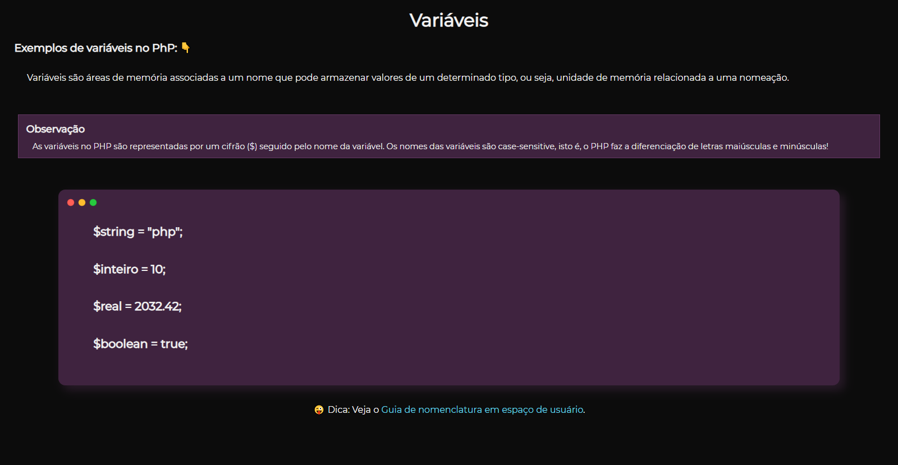
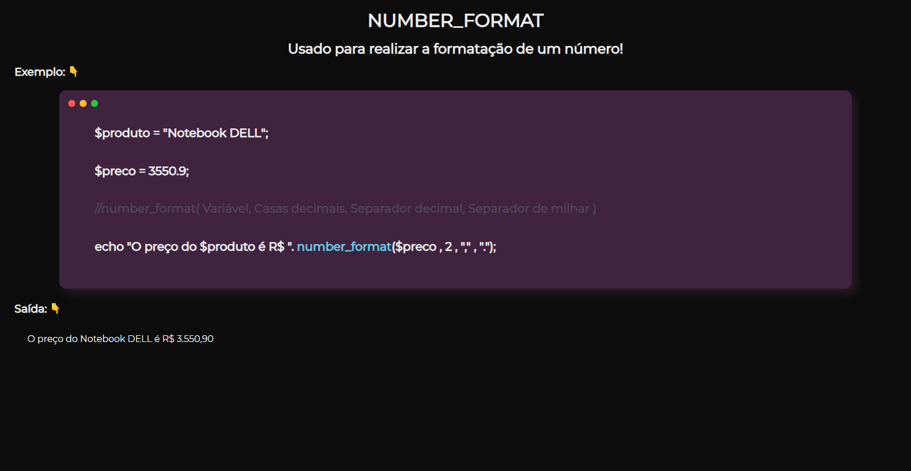

<h1 align="center">Seus primeiros passos com PHP!</h1>

    
    
<b>Aprenda uma linguagem que é bastante popular e que, muitas vezes, é a porta de entrada para muitas empresas!</b>

  

## Sobre o repositório 🗂

Repositório criado com o objetivo de ajudar outros a entenderem melhor a linguagem PHP! Assim, você poderá ver a aplicação e explicação de cada recurso que é utilizada em cada arquivo (como variáveis, funções e etc). Caso você não conheça o PHP e esteja iniciando no "maravilhoso universo da programação", haverá a seguir uma breve explicação do que é o PHP e como você pode começar a codificar!

## Sobre o PHP 🐘

No próprio site do php.net, descreve o PHP da seguinte forma: "O PHP (um acrônimo recursivo para PHP: Hypertext Preprocessor) é uma linguagem de script open source de uso geral, muito utilizada, e especialmente adequada para o desenvolvimento web e que pode ser embutida dentro do HTML."

O PHP é executado na parte do servidor e entregando para o cliente geralmente um conjunto de HTML, CSS e JavaScript. Com isso, é possível interagir com bancos de dados e aplicações existentes no servidor com a vantagem de não expor o código fonte PHP para o cliente. 

O PHP é muito utilizado no Back End de algumas aplicações, como por exemplo o Facebook, que faz uso da linguagem. 

  

## Como executar códigos PHP 💻

Para abrir e executar os códigos PHP presentes em alguns arquivos, é importante realizar a instalação de algum pacote de instalação que contenha: apache (servidor HTTP), MYSQL e o próprio PHP. Para começar no PHP, basta apenas baixar o xampp ou wamp e já poderá começar a "brincar". No entanto, caso ache necessário, baixe o PHP e configure ele em suas variáveis de ambiente! 

## Fotos do projeto 📸

    

    

## Autor

🙎‍♂ **Lucas Alvarenga**

* Meu Portifólio: https://alvarengadev.firebaseapp.com
* Github: [@Alvarenga-Dev](https://github.com/Alvarenga-Dev)

## Dá uma estrelinha e compartilha! ⭐️🚀

Referências: [Php.net](https://www.php.net/) & [Devmedia](https://www.devmedia.com.br/)  
Copyright © 2019 [Lucas Alvarenga](https://github.com/Alvarenga-Dev).  
