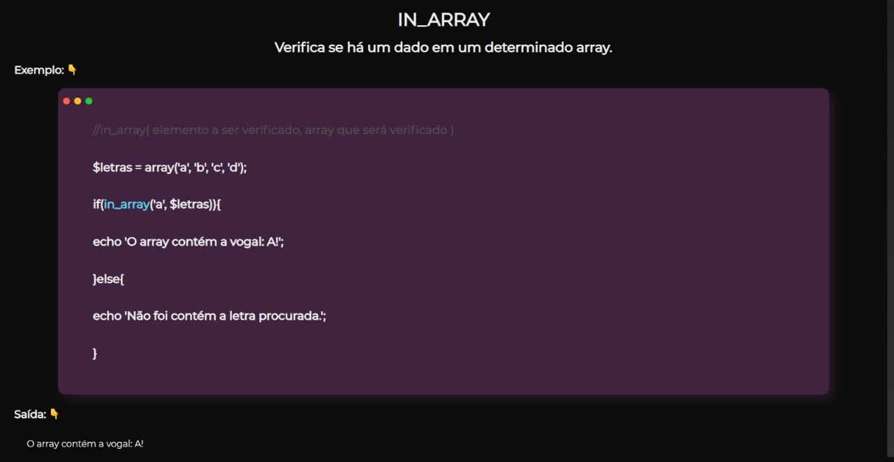

<h1 align="center">Seus primeiros passos com PHP!</h1>

    
    
<b>Aprenda uma linguagem que é bastante popular e que, muitas vezes, é a porta de entrada para muitas empresas!</b>

  

## Sobre o repositório 🗂

Repositório criado com o objetivo de ajudar outros a entenderem melhor a linguagem PhP! Assim, você poderá ver a aplicação e explicação de cada recurso que é utilizada em cada arquivo (como variáveis, funções e etc). Caso você não conheça o PhP e esteja iniciando no "maravilhoso universo da programação", haverá a seguir uma breve explicação do que é o php e como você pode começar a codificar!

## Sobre o PhP 🐘 (EM PRODUÇÃO)

  

## Exemplo de como está cada arquivo .php - Funções:

    
    
<b>Explica de maneira breve o objetivo de cada função, com exemplo de uso e sua respectiva saída!</b>

## Autor

🙎‍♂ **Lucas Alvarenga**

* Meu Portifólio: https://alvarengadev.firebaseapp.com
* Github: [@Alvarenga-Dev](https://github.com/Alvarenga-Dev)

## Dá uma estrelinha e compartilha! ⭐️🚀

Copyright © 2019 [Lucas Alvarenga](https://github.com/Alvarenga-Dev).  
